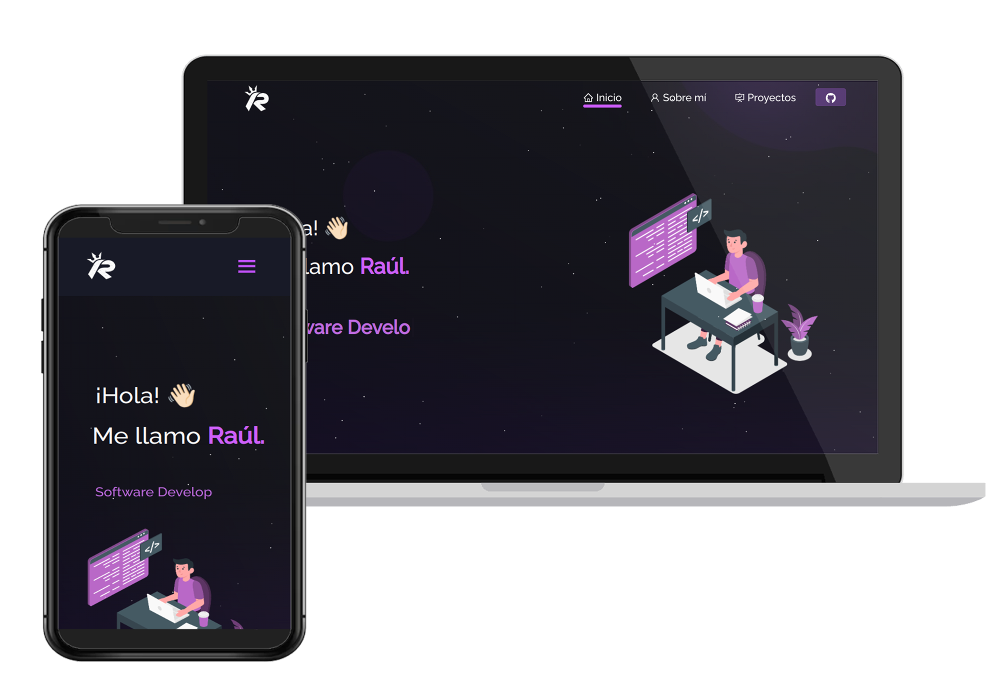

# Personal Portfolio

    

 &nbsp;
 &nbsp;
 &nbsp;

## Introduction

This project is a web application built on React.js.

It serves as a collection of my recent projects, ways to contact me, and more. Please feel free to explore and reach out if you have any questions or would like to collaborate.

## Contact

You can reach me via:

- **Email**: [rmm0.office@gmail.com](mailto:rmm0.office@gmail.com)
- **LinkedIn**: [Raúl Mora](https://www.linkedin.com/in/rmm0/)

## Projects

Here are some of my recent projects:

### [Nexus Play](https://github.com/raulv7z/nexus-play)

Nexus Play is a digital video game store where gamers can discover and purchase their favorite games conveniently.

You can find a wide selection of digital titles across various genres, ensuring there's something for every gamer's taste.

## Credits

This repository was originally forked from [Soumyajit Behera](https://github.com/soumyajit4419).

I appreciate their work which served as inspiration and base for this portfolio.